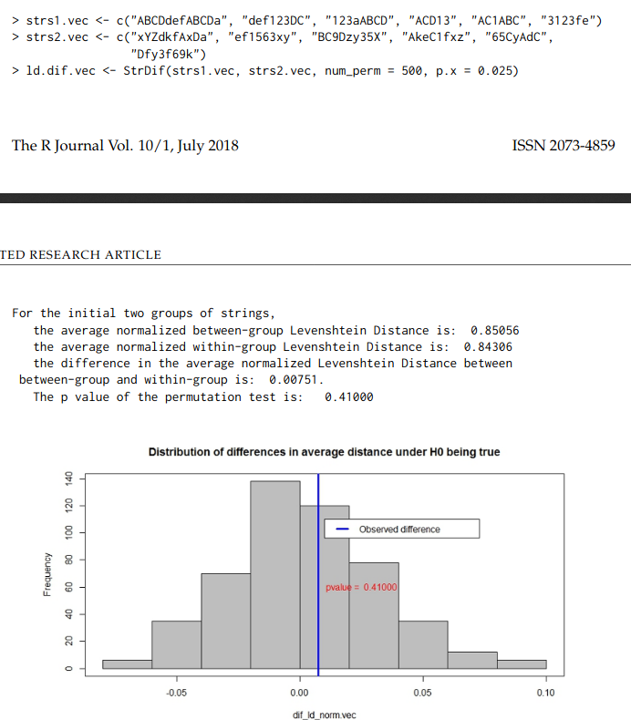
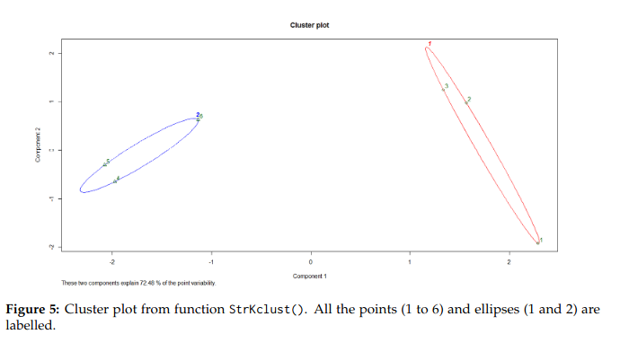

```{r, echo = TRUE, results = 'hide'}
####################################################
# R Script
####################################################
library(GrpString)


####################################################
# EveS
####################################################

event.vec <- c("aoi_1", "aoi_2", "aoi_3", "aoi_2", "aoi_1")
eve.names <- c("aoi_1", "aoi_2", "aoi_3")
labels <- c("a", "b", "c")
EveS(event.vec, eve.names, labels)


####################################################
# EveStr
####################################################

event.df <- data.frame(c("aoi_1", "aoi_2"),
                         c("aoi_1", "aoi_3"),
                         c("aoi_3", "aoi_5"))
event.name.vec <- c("aoi_1", "aoi_2", "aoi_3", "aoi_4", "aoi_5")
label.vec <- c("a", "b", "c", "d", "e")
EveStr(event.df, event.name.vec, label.vec)


####################################################
# EveString
####################################################

data(eventChar.df)
event1d <- paste(path.package("GrpString"), "/extdata/eve1d.txt", sep = "")
EveString(event1d, eventChar.df$event, eventChar.df$char)


####################################################
# DupRm
####################################################

dup1 <- "000<<<<<DDDFFF333333qqqqqKKKKK33FFF"
dup3 <- "aaBB111^^~~~555667777!!!###$$$$$$&&&(((((***)))))@@@@@>>>>99"
dup13 <- c(dup1, dup3)
DupRm(dup13)


####################################################
# CommonPatt
####################################################

strs.vec <- c("ABCDdefABCDa", "def123DC", "123aABCD", "ACD13", "AC1ABC",
                "3123fe")
CommonPatt(strs.vec, low = 30)


####################################################
# CommonPattern
####################################################

strs.vec <- c("ABCDdefABCDa", "def123DC", "123aABCD", "ACD13", "AC1ABC",
                "3123fe")
CommonPattern(strs.vec, low = 30, high = 50, interval = 20)


####################################################
# PatternInfo
####################################################

strs.vec <- c("ABCDdefABCDa", "def123DC", "123aABCD", "ACD13", "AC1ABC",
                "3123fe")
patts <- c("ABC", "123")
PatternInfo(patts, strs.vec)


####################################################
# FeaturedPatt
####################################################

s_grp1 <- c("ABC123", "123ABC", "ABCx123", "123xyz", "xyz123")
s_grp2 <- c("xyz123", "xyzA123", "123xyz", "ABC123", "x123")

p1 <- c("123", "ABC")
p2 <- c("123", "xyz")

FeaturedPatt(p1, p2, s_grp1, s_grp2)


####################################################
# TransInfo
####################################################

strs.vec <- c("ABCDdefABCDa", "def123DC", "123aABCD", "ACD13", "AC1ABC",
                "3123fe")
TransInfo(strs.vec)


####################################################
# TransMx
####################################################

strs.vec <- c("ABCDdefABCDa", "def123DC", "123aABCD", "ACD13", "AC1ABC",
                "3123fe")
TransMx(strs.vec)


####################################################
# TransEntro
####################################################

stra.vec <- c("ABCDdefABCDa", "def123DC", "A", "123aABCD", "ACD13", "AC1ABC", "3123fe")
TransEntro(stra.vec)
```
```{r}
####################################################
# StrDif
####################################################

strs1.vec <- c("ABCDdefABCDa", "def123DC", "123aABCD", "ACD13", "AC1ABC",
                 "3123fe")
strs2.vec <- c("xYZdkfAxDa", "ef1563xy", "BC9Dzy35X", "AkeC1fxz", "65CyAdC",
                 "Dfy3f69k")
ld.dif.vec <- StrDif(strs1.vec, strs2.vec, num_perm = 500, p.x = 0.025)
```

```{r}

####################################################
# StrHclust
####################################################

strs3.vec <- c("ABCDdefABCDa", "AC3aABCD", "ACD1AB3", "xYZfgAxZY", "gf56xZYx",
                 "AkfxzYZg")
StrHclust(strs3.vec)
```
```{r}

####################################################
# StrKclust
####################################################

strs3.vec <- c("ABCDdefABCDa", "AC3aABCD", "ACD1AB3", "xYZfgAxZY", "gf56xZYx",
                 "AkfxzYZg")
StrKclust(strs3.vec)

```



## Problemy
- minimalna nieścisłość przy obliczaniu p value - wynika z zastosowania metody monte carlo w celu ograniczenia liczby wykonywanych operacji
- prezentacja efektów działania klasteryzacji na grafice w lustrzanym odbiciu


## Jak naprawić
- zastosować ziarno losowości (sugerowane) bądź nie stosować przybliżeń gdzie tylko to możliwe

# Podsumowanie
| Kategoria | Ocena |
|-----------|-------|
| Dostęp do zewnętrznych zasobów |➖➖➖➖➖️|
| Kompatybilność z nowszymi wersjami |✅✅✅✅✅|
| Kwestie graficzne/estetyczne |✅✅✅✅✅|
| Brak problemów przy dodatkowej konfiguracji |✅✅✅✅✅|
| Odporność na wpływ losowości |✅✅✅✅❌|
| Dostępność kodów źródłowych |✅✅✅✅✅|

### Session info
```{r, echo=FALSE, cache=TRUE}
sessionInfo()
```