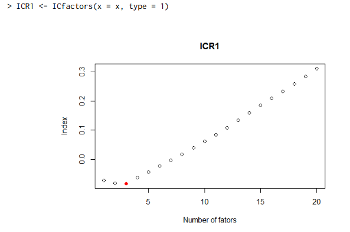
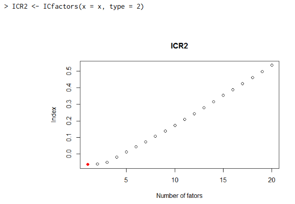
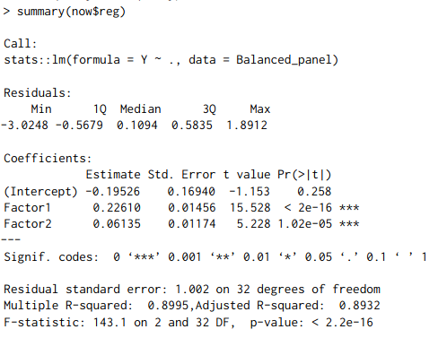
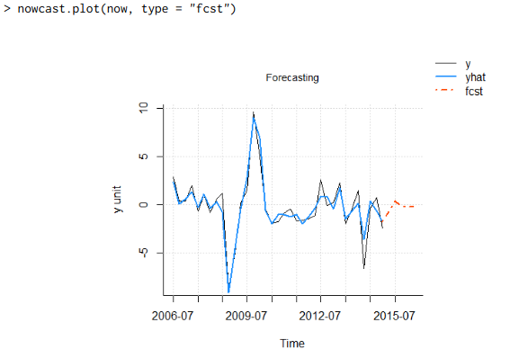
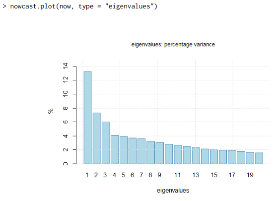
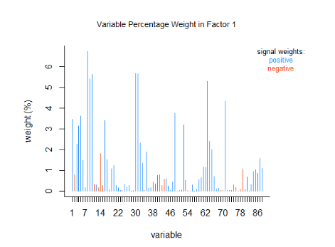
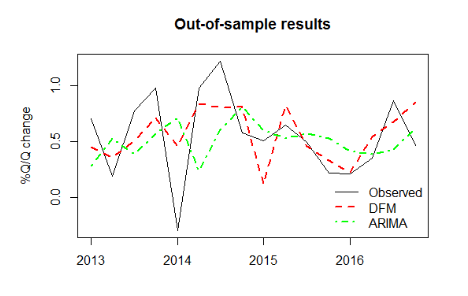

# Nowcasting: An R Package for PredictingEconomic Variables Using DynamicFactor Models
## Serge de Valk, Daiane de Mattos and Pedro Ferreira
## https://journal.r-project.org/archive/2019/RJ-2019-020/RJ-2019-020.pdf

```{r setup, include=FALSE}
knitr::opts_chunk$set(echo = TRUE)
```

```{r}
library(nowcasting)
data(BRGDP)

vintage <- PRTDB(mts = BRGDP$base, delay = BRGDP$delay, vintage = "2015-06-01")
base <- window(vintage, start = c(2005,06), frequency = 12)
x <- Bpanel(base = base, trans = BRGDP$trans)

GDP <- base[,which(colnames(base) == "PIB")]
window(GDP, start = c(2015,1))
GDP_qtr <- month2qtr(x = GDP,reference_month = 3)
window(GDP_qtr, start = c(2015,1))

y <- diff(diff(GDP_qtr),4)
y <- qtr2month(y)

ICR1 <- ICfactors(x = x, type = 1)
```




```{r}
ICR2 <- ICfactors(x = x, type = 2)
```


```{r}
frequency <- c(4,rep(12,ncol(x)))
data <- cbind(y, x)
now <- nowcast(formula = y~., data = data, r = 2, q = 2 , p = 2, method = "2s_agg",frequency = frequency)
summary(now$reg)
```



```{r}
nowcast.plot(now, type = "fcst")
```


```{r}
nowcast.plot(now, type = "eigenvalues")
```


```{r}
nowcast.plot(now, type = "eigenvectors")
```

```{r}

level_forecast <- na.omit(now$yfcst[,3])[1] - tail(na.omit(GDP_qtr),5)[1] +
  +   tail(na.omit(GDP_qtr),5)[5] + tail(na.omit(GDP_qtr),5)[2]
level_forecast

position_q2_2015 <- which(time(BRGDP$GDP) == 2015.25)
BRGDP$GDP[position_q2_2015]

# start of the second working example
data(NYFED)
NYFED$legend$SeriesName

base <- NYFED$base
blocks <- NYFED$blocks$blocks
trans <- NYFED$legend$Transformation
frequency <- NYFED$legend$Frequency

#x <- Bpanel(base = base, trans = trans, NA.replace = F, na.prop = 1)
data <- Bpanel(base = base, trans = trans, NA.replace = FALSE, na.prop = 1)
#nowEM <- nowcast(y = "GDPC1", x = x, r = 1, p = 1, method = "EM", blocks = blocks, frequency = frequency)
base <- NYFED$base
blocks <- NYFED$blocks$blocks
trans <- NYFED$legend$Transformation
frequency <- NYFED$legend$Frequency
delay <- NYFED$legend$delay
nowEM <- nowcast(formula = GDPC1~., data = data, r = 1, p = 1, method = "EM",blocks = blocks, frequency = frequency)
nowcast.plot(nowEM)

fcst_dates <- seq.Date(from = as.Date("2013-03-01"),to = as.Date("2017-12-01"),by = "quarter")
fcst_results <- NULL
for(date in fcst_dates){
  vintage <- PRTDB(data, delay = delay, vintage = date)
  nowEM <- nowcast(formula = GDPC1~., data = vintage, r = 1, p = 1, method = "EM",blocks = blocks, frequency = frequency)
  fcst_results <- c(fcst_results,tail(nowEM$yfcst[,3],1))
  }
fcst_results
```




# Podsumowanie
| Kategoria | Ocena |
|-----------|-------|
| Dostęp do zewnętrznych zasobów |➖➖➖➖➖️|
| Kompatybilność z nowszymi wersjami |✅✅✅✅❌|
| Kwestie graficzne/estetyczne |✅✅✅✅✅|
| Brak problemów przy dodatkowej konfiguracji |✅✅✅✅✅|
| Odporność na wpływ losowości |✅✅✅✅✅|
| Dostępność kodów źródłowych |✅✅✅✅❌|

Problem z kompatybilnością - kod dołączony do artykułu nie jest spójny z tym zawartym w dokumencie z artykułem. Celem udanej reprodukcji należało zmodyfikować dołączony plik .R.
### Session info
```{r, echo=FALSE, cache=TRUE}
sessionInfo()
```


