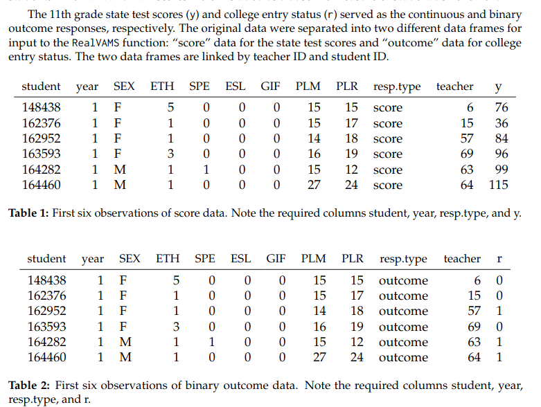
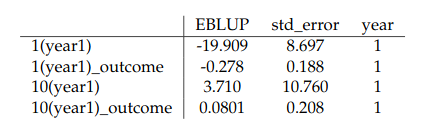
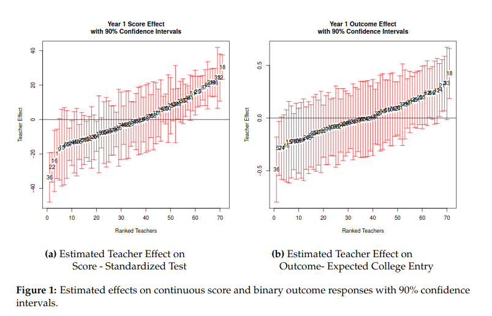
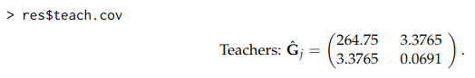
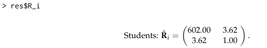

# RealVAMS: An R Package for Fitting aMultivariate Value-added Model (VAM)
## by Jennifer Broatch, Jennifer Green, and Andrew Karl
## https://journal.r-project.org/archive/2018/RJ-2018-033/RJ-2018-033.pdf

```{r message=FALSE, warning=FALSE, results='hide'}

library(RealVAMS)


data(example.outcome.data)
data(example.score.data)


res=RealVAMS(example.score.data, example.outcome.data, persistence = "CP",school.effects = FALSE,
             REML = TRUE, score.fixed.effects = formula(~as.factor(year)+cont_var),
             outcome.fixed.effects = formula(~1), max.iter.EM = 10,
             outcome.family = binomial(link = "probit"),
             tol1 = 1e-07, max.PQL.it = 30, pconv = .Machine$double.eps*1e9, var.parm.hessian = TRUE,
             verbose = TRUE)
```

```{r}

#Extraction of output for discusion
example.score.data[1:5,]
example.outcome.data[1:5,]
```

```{r}
res$teach.effects[1:4,]
```


```{r}
plot(res)
```

```{r}
res$teach.cov
```



```{r}
res$R_i

```


## Problemy
- najprawdopodobniej dane zawarte w pakiecie uległy zmianie, bowiem już ich prezentacja różni się od tej w artykule. Warto dodać, że to jedyne dane załączone w prezentowanym pakiecie, a ID studentów prezentowane w tekście nie występują w danych.
- operacja obliczenia macierzy kowariancji oraz błędów (R_i) zwraca zupełnie inne wyniki niż zawarte w artykule
- prezentowane w artykule przykładowe wykresy prezentują inne wyniki niż te w załączonym materiale

## Jak naprawić
- nastąpił błąd nieścisłości danych - brak możliwości uzyskania danych wykorzystanych do stworzenia artykułu. Twórcy artykułu mogą zaktualizować dołączone dane.

# Podsumowanie
| Kategoria | Ocena |
|-----------|-------|
| Dostęp do zewnętrznych zasobów |➖➖➖➖➖️|
| Kompatybilność z nowszymi wersjami |✅❌❌❌❌|
| Kwestie graficzne/estetyczne |✅✅✅✅✅|
| Brak problemów przy dodatkowej konfiguracji |✅✅✅✅✅|
| Odporność na wpływ losowości |✅✅✅✅✅|
| Dostępność kodów źródłowych |✅✅✅✅✅|

### Session info
```{r, echo=FALSE, cache=TRUE}
sessionInfo()
```

