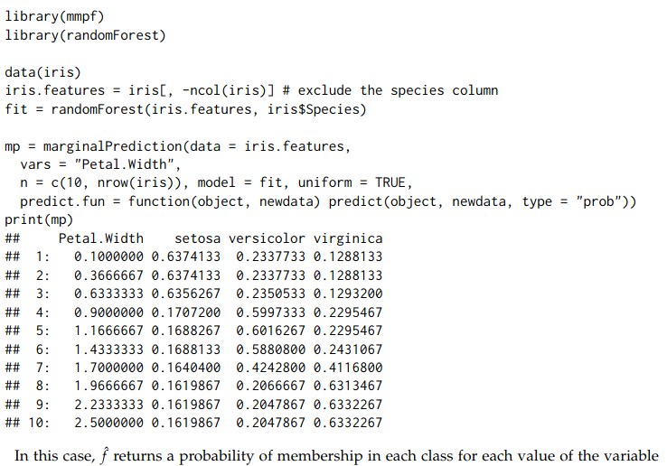
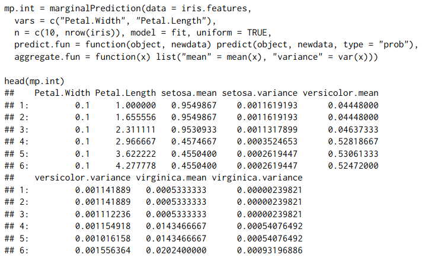
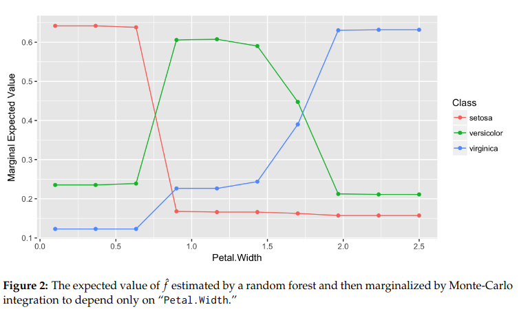
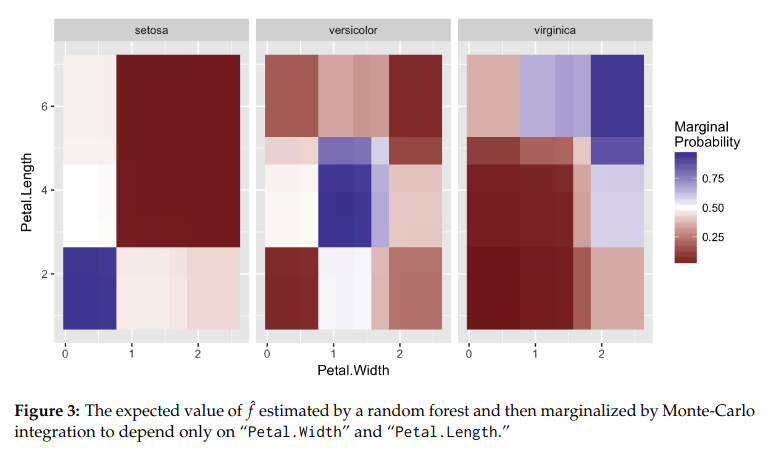
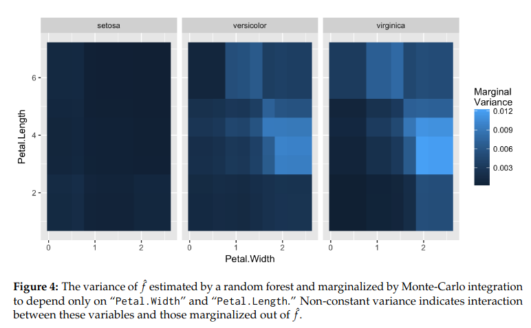

# mmpf: Monte-Carlo Methods forPrediction Functions
## Zachary M. Jones
## https://journal.r-project.org/archive/2018/RJ-2018-038/RJ-2018-038.pdf

```{r}
library(mmpf)
library(randomForest)
data(iris)
iris.features = iris[, -ncol(iris)]
# exclude the species column
fit = randomForest(iris.features, iris$Species)
mp = marginalPrediction(data = iris.features,
                        vars = "Petal.Width",
                        n = c(10, nrow(iris)),
                        model = fit, uniform = TRUE,
                        predict.fun = function(object, newdata) predict(object, newdata, type = "prob"))
print(mp)
```

```{r}

mp.int = marginalPrediction(data = iris.features,
                            vars = c("Petal.Width", "Petal.Length"),
                            n = c(10, nrow(iris)),
                            model = fit, uniform = TRUE,
                            predict.fun = function(object, newdata) predict(object, newdata, type = "prob"),
                            aggregate.fun = function(x) list("mean" = mean(x), "variance" = var(x)))
head(mp.int)
```


```{r}

library(ggplot2)
ggplot(mp, aes(x = Petal.Width))+
  geom_line(aes(y = setosa), color = 'red')+
  geom_line(aes(y = versicolor), color = 'green')+
  geom_line(aes(y = virginica), color = 'blue')+
  geom_point(aes(y = setosa), color = 'red')+
  geom_point(aes(y = versicolor), color = 'green')+
  geom_point(aes(y = virginica), color = 'blue')
```


```{r}

to_heat_expected <- rbind(cbind(mp.int[,1:3], 'setosa'), cbind(mp.int[,c(1, 2, 5)], 'versicolor'), cbind(mp.int[,c(1, 2, 7)], 'virginica'), use.names = F)

ggplot(to_heat_expected, aes(x = Petal.Width, y = Petal.Length))+
  geom_tile(aes(fill = setosa.mean))+
  facet_wrap(~V2) +
  scale_fill_gradient2(low = '#711A1E', midpoint = 0.5, mid = 'white',  high = '#3E3491', name = 'Marginal\nProbability')
```


```{r}
to_heat_variance <- rbind(cbind(mp.int[,c(1, 2, 4)], 'setosa'), cbind(mp.int[,c(1, 2, 6)], 'versicolor'), cbind(mp.int[,c(1, 2, 8)],
                                                                                                                'virginica'), use.names = F)

colnames(to_heat_variance) <- c("Petal.Width", 'Petal.Length', 'MarginalVariance', 'species')

ggplot(to_heat_variance, aes(x = Petal.Width, y = Petal.Length))+
  geom_tile(aes(fill = MarginalVariance))+
  facet_wrap(~species)+
  scale_fill_continuous(breaks = seq(0.003, 0.012, 0.003), limits = c(0, 0.012), name = 'Marginal\nVariance')
  


```



## Problemy
- inne wyniki w trakcie wykonywania operacji, spowodowane losowością w procesie tworzenia modelu
- brak dołączonych kodów - funkcje zostały ściągnięte bezpośrednio z artykułu, z kolei wykresy odtworzone na podstawie grafik
- warto zauwazyc, ze pomimo widocznych niescislosci na mapach ciepla, wnioski pozostaja te same

## Jak naprawić
- stosowac ziarno losowosci
- warto dolaczyc kod do wykresow

# Podsumowanie
| Kategoria | Ocena |
|-----------|-------|
| Dostęp do zewnętrznych zasobów |➖➖➖➖➖️|
| Kompatybilność z nowszymi wersjami |✅✅✅✅✅|
| Kwestie graficzne/estetyczne |➖➖➖➖➖|
| Brak problemów przy dodatkowej konfiguracji |✅✅✅✅✅|
| Odporność na wpływ losowości |❌❌❌❌❌|
| Dostępność kodów źródłowych |✅✅❌❌❌|

### Session info
```{r, echo=FALSE, cache=TRUE}
sessionInfo()
```

